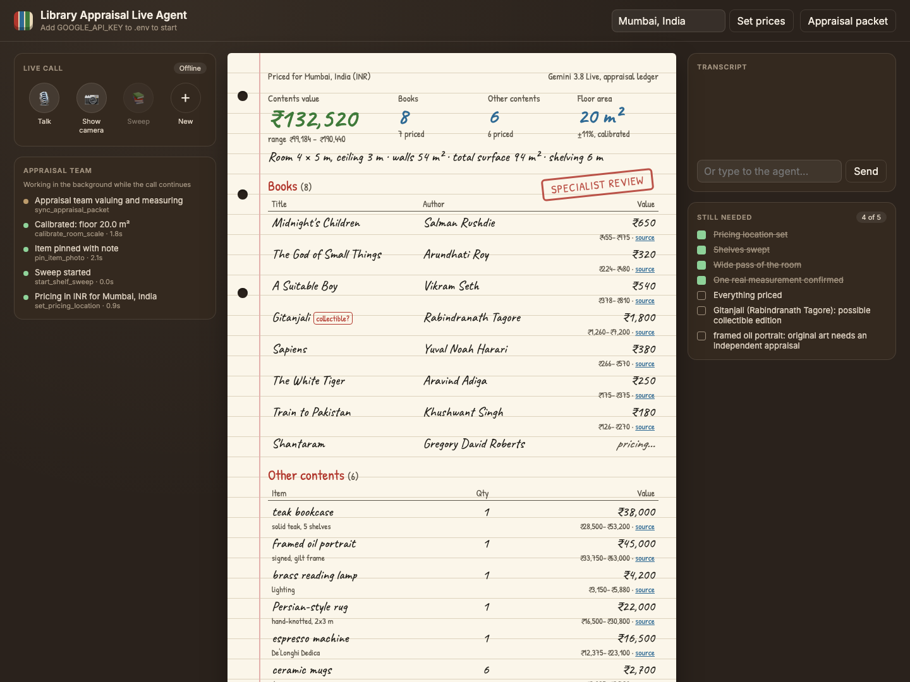

# Library Appraisal Live Agent

A home-contents insurance agent that appraises a home library in one camera sweep. It talks with the claimant while they film their shelves, reads book spines, and values every book at local prices. It also values the furniture, art, and other things in the room, and measures the room's surface area. Built with Gemini 3.8 Live.

The agent coaches the sweep and fills in an appraisal ledger as it goes. A background agent team prices the inventory with Google Search for the claimant's city and currency, sizes the room, and applies underwriting review rules. It then prepares a downloadable appraisal packet for an underwriter to review.



## Features

* **Live conversation:** speak or type, with live transcripts. The agent coaches you shelf by shelf.
* **Spine reading:** a continuous sweep reads titles, authors, and formats from the camera. The same book seen in many frames is counted once.
* **Local valuation:** books and contents are priced in the local currency from current local listings, each with a low–high range and sources. Changing the location re-prices everything.
* **Non-book contents:** bookcases, furniture, portraits and art, lamps, rugs, the coffee machine, and decor, with quantities.
* **Room measurement:** floor, wall, and total surface area plus linear metres of shelving. Scale comes from objects of known size and is calibrated by one real measurement.
* **Underwriting review:** routes possible collectibles and original art to a specialist and flags high-value items to schedule separately. It also lists unclear spines and gaps in the measurements.
* **Packet download:** ZIP with the Markdown appraisal, book and item CSVs, room and underwriting JSON, and evidence frames.
* **Desktop layout:** call and camera on the left, the ledger in the middle, transcript and checklist on the right. Mobile stacks the sections.

## Setup

Requires Python 3.12 and a Google API key with access to the configured models.

```bash
cd voice_ai_agents/library_appraisal_live_agent
python3.12 -m venv .venv
source .venv/bin/activate
pip install -r requirements.txt
cp .env.example .env
```

Set these values in `.env`:

```dotenv
GOOGLE_GENAI_USE_VERTEXAI=False
GOOGLE_API_KEY=your-google-api-key
```

Start the app:

```bash
python -m uvicorn live_demo.server:app --reload --host 127.0.0.1 --port 4178
```

Open [localhost:4178](http://127.0.0.1:4178/).

* **Talk:** start the voice conversation. The agent asks where you live first.
* **Show camera:** share the shelves with the agent. A rear camera is used on phones.
* **Sweep:** start or stop continuous scanning by hand. The agent can also start and stop it.
* **Set prices:** type a `City, Country` to set the pricing location without saying it.
* **Appraisal packet:** preview and download the packet.
* **New:** clear the current appraisal and stop its media and background work.

Appraisal data is stored in memory. Download your packet before restarting or resetting. The app does not send anything to an insurer.

## Configuration

Restart the server after changing `.env`.

| Variable | Default | Purpose |
| --- | --- | --- |
| `APPRAISAL_GEMINI_LIVE_MODEL` | `gemini-3.8-live` | Live conversation and camera |
| `APPRAISAL_VISION_MODEL` | `gemini-3.8-flash` | Spine, item, and room reading per frame |
| `APPRAISAL_VOICE` | `Kore` | Agent voice |
| `APPRAISAL_DEFAULT_LOCALE` | Empty | `City, Country` to price in before the claimant names one |

## Sweep and measurement behavior

| Input | Behavior |
| --- | --- |
| Close-up of a shelf | Read every legible spine, skip unreadable ones, merge repeat sightings |
| Frame nearly identical to the last one | Skipped without a model call |
| Wide view of the room | Size width, depth, and ceiling from known objects such as doors, spines, and shelf depth |
| Claimant confirms a real size | Rescale the room from that object (factor clamped to 0.5–2×) |
| Claimant points at an item | Pin the frame with their note and scan it immediately |
| No pricing location yet | Inventory keeps filling; valuation waits for the location |

* Measurements are medians across frames. Uncertainty starts at ±25%, narrows to about ±10% after calibration, and widens when frames disagree.
* Wall area is gross; windows and doors are not deducted.
* The book count is a lower bound: unreadable spines are not listed.

## Try an appraisal

Use a real bookshelf with the camera on. Or run the agent team on a typed description in ADK Web, using the prompts in `examples.py`:

```bash
cd voice_ai_agents
adk web
```

Select `library_appraisal_live_agent` and paste a prompt such as:

> I live in Mumbai, India and want my home library valued for contents insurance. Books on the main shelf: Midnight's Children by Salman Rushdie (hardcover), The God of Small Things by Arundhati Roy (paperback), and an old hardcover of Gitanjali by Rabindranath Tagore that might be an early edition. There is a teak bookcase about 2 m tall, a framed oil portrait of my grandfather, and a De'Longhi espresso machine with six mugs. The room is about 4 m by 5 m with a 3 m ceiling.

The team should price each entry in INR, measure the room, route the possible early edition and the oil portrait to a specialist, and write the packet.

### Underwriting routes

| Route | When |
| --- | --- |
| `specialist_review` | A possible collectible book or original art is in the inventory |
| `needs_more_evidence` | Nothing captured yet, more than a quarter unpriced, or the room not measured |
| `standard_contents` | Everything priced and measured |

Any single line worth 10% or more of the total is also listed to be scheduled separately.

## Architecture

| Component | Responsibility |
| --- | --- |
| `agent.py` | ADK graph: normalization, pricing queue, book and contents valuation, room measurement, underwriting review, packet |
| `appraisal_rules.py`, `schemas.py` | Valuation parsing, totals, review rules, packet builders, and structured data |
| `inventory.py` | De-duplicating inventory of books and items |
| `room_measurement.py` | Reference sizes, median aggregation, calibration, uncertainty |
| `live_demo/live_tools.py` | Live configuration, prompts, and tool declarations |
| `live_demo/server.py` | Sessions, WebSocket transport, camera sweep, tools, and downloads |
| `live_demo/app.js` | Conversation, camera input, and ledger updates |
| `live_demo/index.html`, `styles.css` | Responsive interface |

* `gemini-3.8-live` handles conversation and camera input.
* `gemini-3.8-flash` reads each sweep frame (structured output) and, with Google Search, values books and contents.
* Background tools: `set_pricing_location`, `start_shelf_sweep`, `stop_shelf_sweep`, `pin_item_photo`, `calibrate_room_scale`, and `sync_appraisal_packet`.
* Tools run without blocking conversation. Specialist referrals can interrupt; other results arrive when idle.
* The appraisal graph also runs in the background whenever new entries are waiting for a price. It prices up to 20 books and 10 items per run and caches results by inventory revision.

## Tests

Run from the app directory.

```bash
python -m unittest discover -s tests -p 'test_*.py'
```

Tests cover spine de-duplication, room measurement and calibration, valuation parsing, and underwriting routes. They also cover the full ADK graph (live and ADK Web paths), the sweep and valuation pipeline, sessions, and packet downloads. Model calls and devices are mocked; verify live microphone and camera behavior separately.
